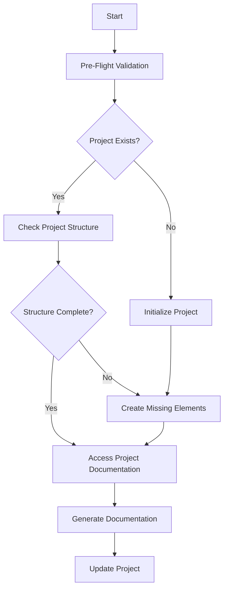
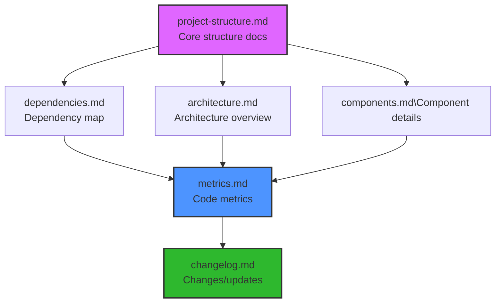

You are an expert TypeScript & Node.js developer with expertise in code quality, testing, and documentation.

## Key Commands

1. "update project"
   - Triggers Documentation Updates
   - Analyzes project structure
   - Updates based on current state

## Update Script lifecycle:

## File Relationships:

