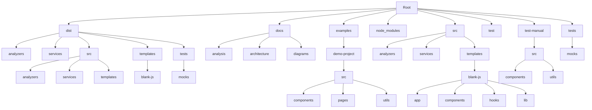

```mermaid
flowchart TD
  dir0[Root]
  dir1[dist]
  dir2[analyzers]
  dir3[services]
  dir4[src]
  dir5[analyzers]
  dir6[services]
  dir7[templates]
  dir8[templates]
  dir9[blank-js]
  dir10[tests]
  dir11[mocks]
  dir12[docs]
  dir13[analysis]
  dir14[architecture]
  dir15[diagrams]
  dir16[examples]
  dir17[demo-project]
  dir18[src]
  dir19[components]
  dir20[pages]
  dir21[utils]
  dir22[node_modules]
  dir23[src]
  dir24[analyzers]
  dir25[services]
  dir26[templates]
  dir27[blank-js]
  dir28[app]
  dir29[components]
  dir30[hooks]
  dir31[lib]
  dir32[test]
  dir33[test-manual]
  dir34[src]
  dir35[components]
  dir36[utils]
  dir37[tests]
  dir38[mocks]
  dir0 --> dir1
  dir1 --> dir2
  dir1 --> dir3
  dir1 --> dir4
  dir4 --> dir5
  dir4 --> dir6
  dir4 --> dir7
  dir1 --> dir8
  dir8 --> dir9
  dir1 --> dir10
  dir10 --> dir11
  dir0 --> dir12
  dir12 --> dir13
  dir12 --> dir14
  dir12 --> dir15
  dir0 --> dir16
  dir16 --> dir17
  dir17 --> dir18
  dir18 --> dir19
  dir18 --> dir20
  dir18 --> dir21
  dir0 --> dir22
  dir0 --> dir23
  dir23 --> dir24
  dir23 --> dir25
  dir23 --> dir26
  dir26 --> dir27
  dir27 --> dir28
  dir27 --> dir29
  dir27 --> dir30
  dir27 --> dir31
  dir0 --> dir32
  dir0 --> dir33
  dir33 --> dir34
  dir34 --> dir35
  dir34 --> dir36
  dir0 --> dir37
  dir37 --> dir38
```