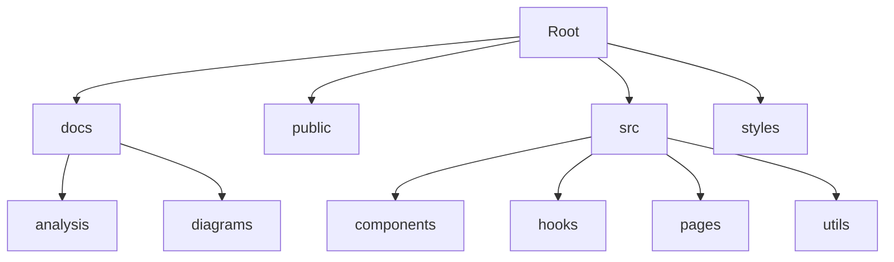

```mermaid
flowchart TD
  dir0[Root]
  dir1[docs]
  dir2[analysis]
  dir3[diagrams]
  dir4[public]
  dir5[src]
  dir6[components]
  dir7[hooks]
  dir8[pages]
  dir9[utils]
  dir10[styles]
  dir0 --> dir1
  dir1 --> dir2
  dir1 --> dir3
  dir0 --> dir4
  dir0 --> dir5
  dir5 --> dir6
  dir5 --> dir7
  dir5 --> dir8
  dir5 --> dir9
  dir0 --> dir10
```